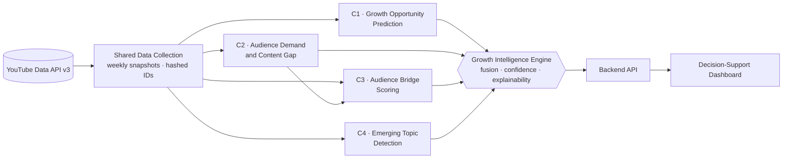

<div align="center">

# Growth Intelligence Framework

**A Public-Data-Driven Growth Intelligence Framework for Underperforming YouTube Channels in a Multi-Channel Media Organization**

SLIIT &nbsp;|&nbsp; IT4010 Research Project &nbsp;|&nbsp; Centre of Excellence in AI (CoEAI) &nbsp;|&nbsp; Data Science
<br/>
Project ID: **J26-DS-334**

<br/>


[Overview](#overview) &nbsp;·&nbsp;
[Architecture](#system-architecture) &nbsp;·&nbsp;
[Components](#research-components) &nbsp;·&nbsp;
[Data and Ethics](#data-and-ethics) &nbsp;·&nbsp;
[Getting Started](#getting-started) &nbsp;·&nbsp;
[Team](#team)

</div>

---

## Overview

<table>
<tr>
<td width="50%" valign="top">

#### The problem
- Media organizations run **many YouTube channels**. A few grow while others stall.
- Decisions about weak channels are usually made by **intuition**.
- YouTube Studio shows each channel **on its own** and doesn't explain **why** a channel is underperforming or **what to do next**.

</td>
<td width="50%" valign="top">

#### Our solution
A framework that uses **only public YouTube data** to:
- predict real **growth opportunities**
- find **unmet audience demand**
- discover **cross-channel audience bridges**
- detect **emerging topics** early

The results are combined into **explainable recommendations** on a decision-support dashboard.

</td>
</tr>
</table>

#### Research question

> *How can public YouTube data be used to diagnose underperforming channels in a multi-channel media organization and generate explainable, data-driven growth recommendations, without access to private channel analytics?*

#### Key challenges

| Challenge | Why it matters | How it is addressed |
|---|---|---|
| **Data scarcity** | Small channels have too little history for single-channel models | Pooled learning across niche-similar channels (C1, C4) |
| **Channel heterogeneity** | Raw view counts can't be compared across channel sizes | Normalised, channel-relative indicators (C1) |
| **Multilingual audience** | Comments mix Sinhala, English and Tanglish | Multilingual cleaning and a distilled intent classifier (C2) |
| **Trust** | Managers need justified decisions | SHAP, confidence scores and explanations (all components) |

---

## System architecture



| Lifecycle | Flow |
|---|---|
| **Research** | Data → Preprocessing → Model / Method → Evaluation → Results |
| **System** | Results → Backend (Growth Intelligence Engine) → Frontend (Dashboard) |

---

## Research components

<table>
<tr>
<td width="50%" valign="top">

#### Component 1 — Growth Opportunity Prediction
*Channel-Specific Growth Opportunity Prediction with Pooled Learning*

**Owner:** Samarasinghe S I (IT23333802)

- Normalised indicators and channel-relative labels
- Similarity-weighted pooled learning
- Random Forest, XGBoost and LightGBM baselines
- SHAP explanations and time-based validation

**Output:** opportunity score, confidence, SHAP explanation
<br/>
[`research/component_1`](research/component_1/README.md)

</td>
<td width="50%" valign="top">

#### Component 2 — Audience Demand and Content Gap
*Quantified Audience Demand Mining and Content-Gap Divergence*

**Owner:** Kahandawa K A N N (IT23307094)

- Sinhala / English / Tanglish comment cleaning
- Weak supervision and LLM pseudo-labels distilled into a light intent classifier
- BERTopic demand and supply topics
- Jensen-Shannon and Wasserstein divergence

**Output:** demand-supply divergence per topic and channel
<br/>
[`research/component_2`](research/component_2/README.md)

</td>
</tr>
<tr>
<td width="50%" valign="top">

#### Component 3 — Audience Bridge Scoring
*Diffusion-Based Cross-Channel Audience Bridge Scoring*

**Owner:** Koonara K M K C (IT23200760)

- Commenter-video-channel-topic graph
- metapath2vec (primary) and HGT embeddings
- Personalized PageRank diffusion
- Louvain and node2vec baselines

**Output:** Audience Bridge Score, confidence, explanation
<br/>
[`research/component_3`](research/component_3/README.md)

</td>
<td width="50%" valign="top">

#### Component 4 — Emerging Topic Detection
*Hierarchically Pooled Dynamic Topic Modelling with Bayesian Changepoint Flagging*

**Owner:** Sankalpa H D T P (IT23323452)

- BERTopic topic extraction
- State-space topic prevalence model
- Hierarchical pooling across channels
- Bayesian Online Changepoint Detection

**Output:** emerging-topic flag, changepoint probability, uncertainty
<br/>
[`research/component_4`](research/component_4/README.md)

</td>
</tr>
</table>

The data formats exchanged between components are defined in [`docs/contracts`](docs/contracts/README.md).

---

## Data and ethics

| Principle | Practice |
|---|---|
| **Public data only** | Official YouTube Data API v3 only: channels, videos, statistics and public comments. No private Studio analytics. |
| **Privacy by design** | Commenter IDs are hashed with a secret salt before storage and never shown in outputs. |
| **Retention** | Raw data follows a 30-day retention rule and is refreshed through weekly snapshots. |
| **Nothing sensitive in git** | Data, models, notebook outputs with comment text, and `.env` are git-ignored. |
| **Compliance** | Use complies with the YouTube API Services Terms of Service. |

---

## Repository structure

<details>
<summary><b>Show folder tree</b></summary>

```
J26-DS-334
├── research/                      research work, one folder per component
│   └── component_1..4/            preprocessing · model · evaluation · notebooks · results
├── shared/                        jointly owned code
│   ├── data_collection/           YouTube API collection and weekly snapshots
│   ├── schemas/                   common data schemas
│   └── utils/                     ID hashing, logging, helpers
├── backend/
│   ├── api/component_1..4/        API routes per component
│   ├── services/component_1..4/   inference services per component
│   ├── services/growth_engine/    fusion, confidence, recommendations
│   └── database/
├── frontend/                      React decision-support dashboard
│   └── src/features/component_1..4/
├── data/                          raw · processed/component_1..4 · snapshots   (git-ignored)
├── models/component_1..4/         trained models and embeddings               (git-ignored)
├── docs/                          architecture · methodology/component_1..4 · contracts
├── config/                        shared non-secret settings
├── tests/component_1..4/
├── .env.example                   environment variable template
└── requirements.txt
```

</details>

---

## Getting started

**Prerequisites:** Python 3.10+, Node.js 18+, and a [YouTube Data API v3 key](https://console.cloud.google.com/).

<details>
<summary><b>Show setup steps</b></summary>
<br/>

**1. Clone the repository**
```bash
git clone https://github.com/Kalharachamod/Framework-for-Underperforming-YouTube-Channels-in-a-Multi-Channel-Media-Organization---J26-DS-334.git
cd Framework-for-Underperforming-YouTube-Channels-in-a-Multi-Channel-Media-Organization---J26-DS-334
```

**2. Create the Python environment**
```bash
python -m venv .venv
# Windows:      .venv\Scripts\activate
# macOS/Linux:  source .venv/bin/activate
pip install -r requirements.txt
```

**3. Configure environment variables**
```bash
cp .env.example .env          # Windows PowerShell: Copy-Item .env.example .env
```

| Variable | Purpose |
|---|---|
| `YOUTUBE_API_KEY` | YouTube Data API v3 key |
| `COMMENTER_HASH_SALT` | Secret salt for hashing commenter IDs (shared within the team, never committed) |
| `VITE_API_URL` | Backend URL for the dashboard (default `http://localhost:8000`) |

> **Note:** Backend and frontend run instructions will be added when implementation begins.

</details>

---

## Development workflow

| Area | Rule |
|---|---|
| **Branches** | `main` is protected. Use `component-<n>/<desc>`, `shared/<desc>` or `frontend/<desc>`. |
| **Commits** | Prefix with `feat:`, `fix:`, `docs:`, `refactor:`, `test:` or `chore:`. |
| **Pull requests** | At least one review. Changes to `shared/`, `docs/contracts/` and `growth_engine/` need all component owners. |
| **Ownership** | Work in your own `component_N` folders. Shared code goes through a pull request. |

See [CONTRIBUTING.md](CONTRIBUTING.md) for full guidelines.

---

## Team

| # | Member | Student ID | Component |
|:-:|---|---|---|
| 1 | Samarasinghe S I | IT23333802 | Growth Opportunity Prediction |
| 2 | Kahandawa K A N N | IT23307094 | Audience Demand and Content Gap |
| 3 | Koonara K M K C | IT23200760 | Audience Bridge Scoring |
| 4 | Sankalpa H D T P | IT23323452 | Emerging Topic Detection |

**Supervisor:** _TBA_ &nbsp;|&nbsp; **Co-supervisor:** _TBA_

---

## Roadmap

- [x] Repository structure and collaboration rules
- [ ] Shared data collection and weekly snapshot pipeline
- [ ] Component output contracts finalised
- [ ] Preprocessing and baseline models
- [ ] Proposed models and evaluation
- [ ] Growth Intelligence Engine
- [ ] Backend API
- [ ] Decision-support dashboard
- [ ] Final evaluation, documentation and report

---

<div align="center">
<sub>Academic research project, Sri Lanka Institute of Information Technology (SLIIT).<br/>Not affiliated with or endorsed by YouTube or Google.</sub>
</div>
